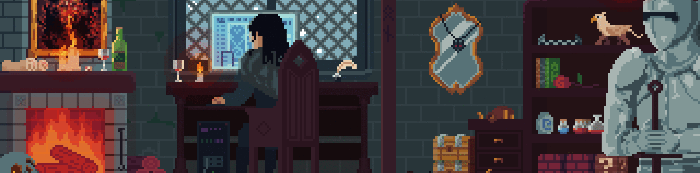

<h1 align="center">Hi Folks! 🖖</h1>

Image by <i><a href="https://www.artstation.com/exceptrea">ExceptRea</a></i>.

## 🏹 About me

- _I'm Felipe! a Front-end Dev living abroad._

- _Always studying and sharing my knowledge whenever possible._

- _In 💘 with Web Development, mainly Front-end._

- _Trying to help other devs in the same situation._

- _Self-taught learner and a night 🦉._

- _**Fun fact**: I do believe penguins are the best animals! <a href="https://en.wikipedia.org/wiki/Linux">🐧</a>_

## 🔮 Tech Stack

These are all the technologies that I already know.

  <!-- HTML Badge -->
  
  <!-- CSS Badge -->
  
  <!-- JavaScript Badge -->
  
  <!-- jQuery Badge -->
  
  <!-- React Badge -->
  
  <!-- SASS Badge -->
  
  <!-- Bootstrap Badge -->
  
  <!-- Git Badge -->
  
  <!-- NPM Badge -->
  
  <!-- Node.js Badge -->
  
  <!-- Markdown Badge -->
  
  <!-- Linux Badge -->
  

## ⚔️ Stats for nerds

For those who like statistics.

  <!-- Programming Languages Card -->
  
  <!-- Commits Info Card -->
  

## 🛡️ Let's talk!

Email me or send a message 🙌

  <!-- Email Badge -->
  
  <!-- Github Badge -->
  

